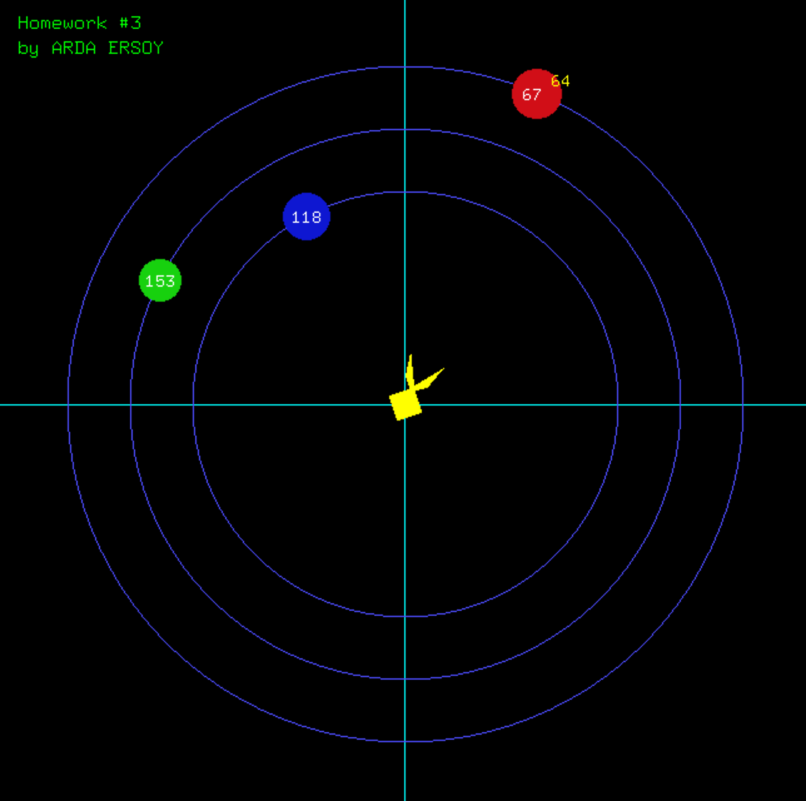

# Shoot-Planets

It is a basic game named shoot planets. There is a mechanism that three ballons are turning and you should hit them simultaneously. 
Written with C++. OpenGL and Glut Libraries are used in this project.

